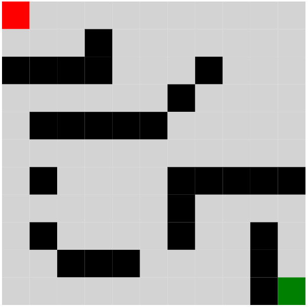
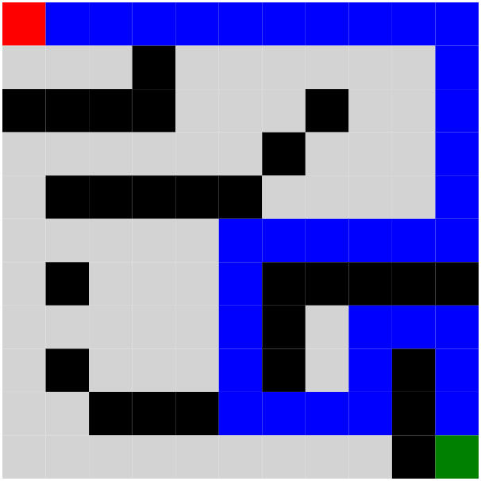

## Part 1 - Text based

First maze:
```
.##..
..#..
.....
```

A* path:
```
x##xx
xx#x.
.xxx.

// . = floor, # = wall, x = path
```

Bigger maze:
```
...W...W
...WW..W
........
..WW.W..
.W..W.W.
WW...W..
W..W....
..W.W.W.
```

A* path:
```
xxxW...W
..xWW..W
..xxxxxx
..WW.W.x
.W..W.Wx
WW...W.x
W..W...x
..W.W.Wx
```

## Part 2 - Visual

Maze:



A* path:

